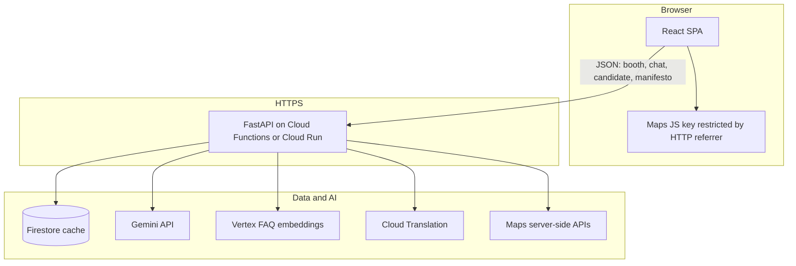

# Data flow and trust boundary (judge-facing)

This diagram shows **what leaves the browser** versus what stays in **Google Cloud** for CivikSutra. EPIC numbers and full voter roll data are **not** stored by the app; users are directed to **ECI / NVSP** for authoritative checks.

**Principle:** Treat the model as **education**, not legal advice. Official rules and dates always come from **ECI / state CEO** portals linked in the in-app trust banner.
